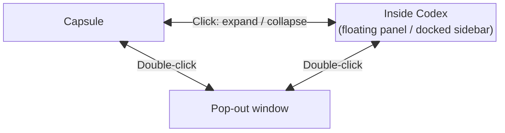

<div align="center">
  
  <h1>CodexBuddy</h1>
  <p><strong>Your desktop companion for Codex: navigate answers and find your next question.</strong></p>
  <p>Answer outlines and next-step suggestions, inside Codex or in a desktop panel.</p>
  <p>
    
    
    
    
  </p>
</div>

**English** · [简体中文](README.zh-CN.md)

CodexBuddy adds a companion panel to Codex / ChatGPT. Navigate long answers, generate follow-up questions, and keep your tools inside the conversation or in a desktop window.

Click the face to expand or collapse the in-chat workbench using your saved placement. Double-click to move it to a desktop window or return it to the chat; Alt+Enter provides the keyboard equivalent. The desktop window stays expanded on a single click. The gear opens settings in your browser. Desktop windows stay on top by default; use the pin beside the gear to turn this off or on. Your choice is saved.

## Features

| Feature | What it does |
| --- | --- |
| Answer outline | Jump to a heading and highlight its location in the answer |
| Next-step suggestions | Generate follow-up questions from the current answer, then copy them or insert them into the composer |
| Docked workbench | Show the outline and suggestions together without covering the chat; use automatic, vertical, or horizontal layouts, drag panels, group tabs, or focus one panel; remember docked and desktop layouts separately |
| Desktop window | On macOS 15+, pop out and return to the embedded panel, move and resize the window, or keep it on top |
| Model quick switch | Use a separate screen-edge control to select the official chat model, reasoning effort, and speed, and save complete presets; this does not change the model used for next-step suggestions |
| Reading and appearance | Choose materials, font size, and summary visibility, with saved preferences |
| Your choice of model | Use an existing Codex login or connect your own model API |

Outlines are parsed locally and do not require a model. Next-step suggestions require model configuration. You can disable either feature independently.

Inside Codex, click the face to expand or collapse the workbench. Double-click it to pop out to the desktop; double-click again in the desktop window to return to the previous compact or expanded state. Split layouts, tabs, and focused panels retain the shared face for returning to the chat.

Drag a panel heading or tab to another panel's edge to split the layout, or to its center to group them as tabs. Double-click a heading or tab to temporarily enlarge that panel; double-click its heading again or press Esc to restore the layout. Keyboard users can focus a heading and press Enter or Space. Complete arrangement options remain in Web settings. Press Esc during a drag to cancel it.

Both panels share the same chat source. The source label and follow/lock menu are temporarily hidden; existing associations are preserved. If the source becomes unavailable, previous results remain available for reading until it reconnects.

## Operations and state transitions

Single-click and double-click below refer to **the eyes on the capsule or at the top of the workbench**.



All three connections work in both directions. A window opened directly from the capsule returns to the capsule; one opened from the in-Codex workbench returns to that workbench. The starting state determines the return destination. A single click in the pop-out keeps it expanded, so no self-loop is drawn.

| Current state | Action | Result |
| --- | --- | --- |
| Capsule | Single-click eyes | Expand inside Codex as a floating panel or docked sidebar, using your Web settings preference |
| Inside Codex | Single-click eyes | Collapse to the capsule and release the sidebar space |
| Capsule / Inside Codex | Double-click eyes | Open an independent window and remember the previous state |
| Pop-out window | Double-click eyes | Return to Codex, restoring the previous compact or expanded state and placement preference |
| Pop-out window | Single-click eyes | Stay expanded |

With the eyes focused, **Alt+Enter** is equivalent to a double-click. Floating and docked are two placements of the second state, selected in Web settings; repeated clicks do not cycle through them. The pop-out window stays on top by default; the pin toggles this, and the gear opens Web settings. Splits, tabs, and temporary panel focus only arrange the contents; they do not add window states.

## Installation and use

### 1. Install

You need the ChatGPT / Codex desktop app, Node.js 22.16+, Rust 1.88+, and Xcode Command Line Tools.

Download and extract the source archive from [Releases](https://github.com/0xTotoroX/codex-buddy/releases), then run these commands in the project directory:

```sh
npm ci
npm run install:local
```

After installation, open **CodexBuddy** from Applications. Node.js and Rust are not required for everyday use.

> If ChatGPT / Codex is already running without a debugging connection, CodexBuddy asks before quitting and reopening it by default. You can select the force-restart option in the launch settings, but this may interrupt tasks or lose unsaved work. An existing debugging connection is reused directly.

### 2. Configure the suggestions model

Open settings from the capsule. Choose your existing Codex login or enter your model API settings, save, and test the connection. Using an existing login requires a working local Codex CLI installation and login session.

The workbench has three main forms: a compact capsule, an expanded in-chat workbench, and an independent window. Inside the chat it can dock on the right or float freely. Collapsing or running out of room returns it to the capsule and releases all sidebar space; a click restores the preferred position. Split direction, tabs, and focus only change the contents. Top controls and refresh buttons appear when the pointer is inside the workbench or a control receives keyboard focus, and remain visible on touch devices.

### 3. Use the workbench

- **Navigate an answer:** open the outline and click a heading to jump to the source text.
- **Ask a follow-up:** refresh the next-step panel to generate suggestions, or enable automatic generation. Clicking a suggestion inserts it without sending by default. If a draft already exists, CodexBuddy asks before appending.
- **View both panels:** in Web settings, use the capsule’s “点击胶囊后展开为” (expand capsule as) option to choose “右侧嵌入工作台” (right sidebar) or “聊天内浮动工作台” (floating inside the chat). Both stay inside the host; the floating option is not an independent desktop window. Drag the left edge to resize the sidebar and the internal divider to change proportions. Drag headings to arrange panels; Web settings provide automatic, vertical, or horizontal layout and restore defaults. The workbench follows a separately opened chat and returns when it closes. When space is insufficient, the capsule explains why and offers an independent window or a directly expanded floating workbench. Once space returns, click it to reopen the sidebar. You can still pop out or return the entire workbench.
- **Adjust the window:** click the face to expand or collapse inside the chat, and double-click (or press Alt+Enter on the face) to pop out or return. Drag the header to move and a lower corner to resize. Desktop windows stay expanded and on top by default; the pin toggles always-on-top. The gear opens Web settings, with an outline for jumping between groups. Buddy follows Codex appearance without changing its colors.

### Model quick switch

Open the control from settings or run `codex-buddy model-control`. Its default shell stays pure black; independently choose matte, frosted, or liquid material with Regular/Clear variants. The capsule, workbench, desktop window, and the three optional model-control materials follow Codex colors in every state. The pure-black model-control palette stays fixed. Web settings continue to follow the browser theme. Typography and icons are shared with the workbench, whose appearance remains unchanged. Select the display, screen edge, and position from settings or the control's menu.

The control stays on the selected display across desktop Spaces and full-screen apps, even when Codex loses focus or is hidden. If Codex disconnects, the control remains visible but model actions require a valid target. Closing the control or stopping the Buddy service removes it. It docks to the right by default, with left and top positions available. Hover to expand; leave for roughly half a second to collapse. Hold `⌥` and drag the entry to reposition it.

Models and reasoning efforts share a matrix. Open search from the menu or with `⌘F`. Hovering does not steal keyboard focus; search, editing, and keyboard interaction can request it. `⌘⇧M` toggles the panel, and the menu lets you keep it open or close the control.

Available models and efforts come from the host. The first selection reads and applies the configuration in one operation, without a separate refresh, then verifies the actual result. You can adjust subsequent configuration while an answer is being generated, provided the official controls allow it. Switching stops if the controls are disabled, the target is ambiguous, or capabilities have not loaded. If the official model list has not yet been observed after connecting, the control waits; there is no need to restart a working host just to load the list.

## Updating and uninstalling

To update, get the latest source and run `npm ci` and `npm run install:local` again. Existing configuration is preserved.

To uninstall, first stop the background service:

```sh
~/.local/bin/codex-buddy stop
```

Then delete `/Applications/CodexBuddy.app` and `~/.local/bin/codex-buddy`. To also remove configuration, delete `~/Library/Application Support/codex-buddy/`.

## Development

Built with **Rust, JavaScript / TypeScript, and React**.

```text
src/               Backend, CLI, and native windows
ui/panel/          Capsule, next-step suggestions, and outlines
ui/settings/       Settings web app
ui/model-control/  Independent model control and official-menu adapter
ui/bridge/         Host communication
tests/            Automated tests
scripts/           Development, build, and installation tools
```

After installing dependencies, open the host through CodexBuddy, then run:

```sh
npm run dev
```

Alternatively, run `npm run install:dev` once to install **CodexBuddy Dev.app**. Opening it starts development in the background, updates saved source automatically, and does not open a terminal. Opening it again brings up the existing workbench. Without a debugging connection, it follows the development launch setting, initially inherited from the everyday installation. Stop background development with `npm run dev:stop`; logs are written to `target/dev/launcher.log`. This launcher depends on the local source tree and development tools. Stop and reopen it after changing development scripts or dependencies; regenerate it after moving the source tree or changing the Node.js path.

For multiple Git worktrees, open **Development source** in the Dev settings page (`npm run dev:settings`). Select a worktree to switch its backend, settings UI, and hot reload together without restarting Codex. The settings address stays the same, and the last successful source is remembered. Each worktree keeps its own configuration. Compilation failure leaves the current source running; connection failure attempts to restore it. Use one Dev supervisor for the target window; stop older standalone Dev sessions before adopting this workflow. An explicit startup override is available with `npm run dev -- --source /path/to/worktree`.

Development mode connects to real Codex. UI changes reload automatically, and Rust changes trigger a rebuild. For command-line development, press Ctrl+C to stop. Development configuration is separate from the everyday installation. Embedded liquid material uses the same SVG renderer in development and release builds.

```sh
npm run verify         # Run checks
npm run build          # Build the application
npm run package        # Create binary and source archives
npm run install:local  # Install the current code locally
```

Building or packaging does not update an installed application. When reporting an issue or contributing a change, include the version, OS, and reproduction steps, and remove credentials and private chat content.

The default README is English. Keep [README.zh-CN.md](README.zh-CN.md) in sync when updating user-facing documentation.

## Privacy and license

Configuration is stored locally. When generating suggestions, relevant answer excerpts are sent to your chosen model service. CodexBuddy does not persist chat bodies or modify the official application bundle. Host updates may affect compatibility.

Original source code is licensed under the [MIT License](LICENSE). Third-party dependencies retain their respective licenses.
