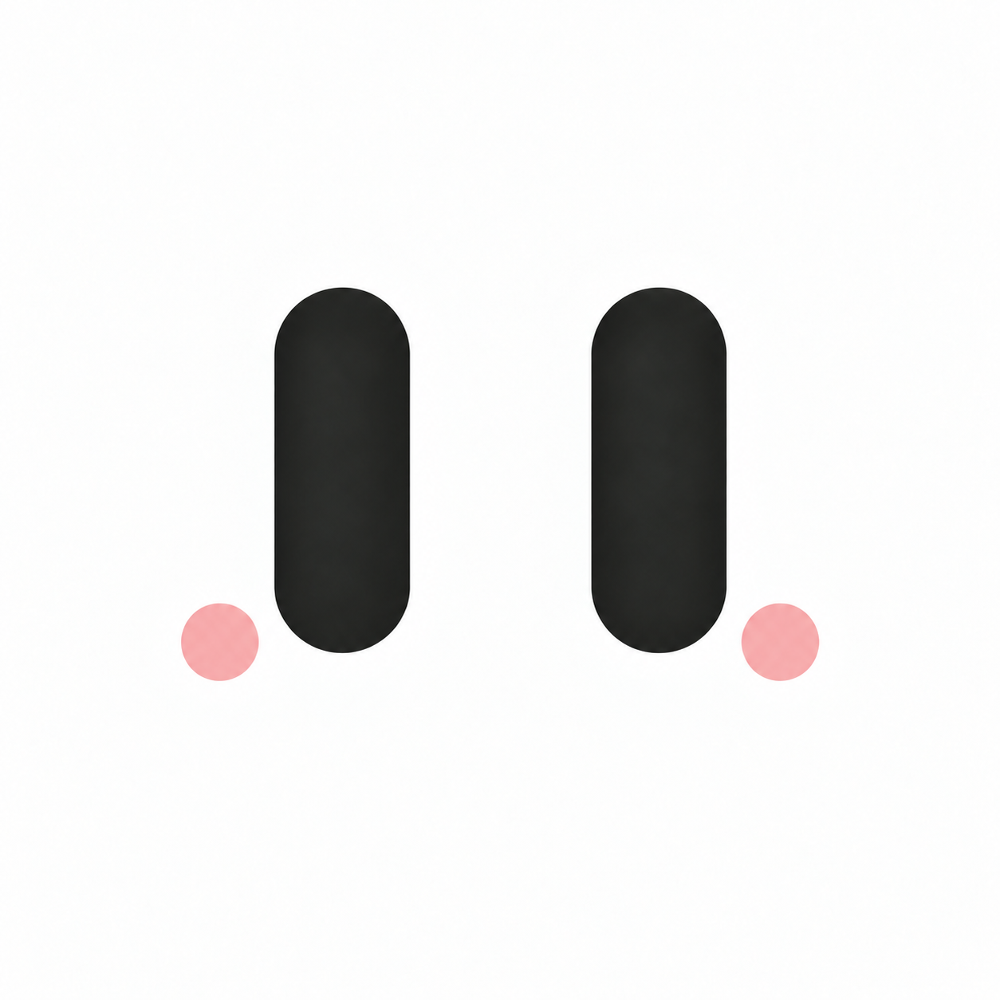
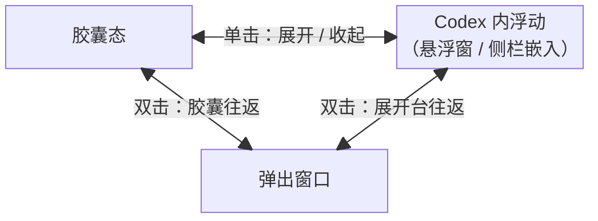

<div align="center">
  
  <h1>CodexBuddy</h1>
  <p><strong>你的 Codex 桌面搭档：看回答大纲，接着问下一步。</strong></p>
  <p>Answer outlines and next-step suggestions, inside Codex or in a desktop panel.</p>
  <p>
    
    
    
    
  </p>
</div>

[English](README.md) · **简体中文**

CodexBuddy 为 Codex / ChatGPT 增加一个随手可用的辅助面板：快速定位长回答，生成下一步问题，留在对话内或弹到桌面使用。

单击表情在胶囊与偏好的聊天内工作台之间收放；双击弹出到桌面或收回聊天，键盘可用 Alt+Enter。独立窗口单击保持展开。右键点击左侧图标打开网页设置；独立窗口默认置顶，可用窗口头部的图钉取消或开启，并记住选择。

## 能做什么

| 功能 | 用途 |
| --- | --- |
| 回答大纲 | 点击标题定位并高亮原文 |
| 下一步建议 | 根据当前回答生成后续问题，复制或填入输入框 |
| 停靠工作台 | 大纲与下一步同时显示，聊天让出空间；支持自动、上下或左右排列，可拖拽编排、合并标签或专注查看，分别记住停靠与浮窗布局 |
| 桌面浮窗 | macOS 15+ 可在内嵌与弹出之间切换，支持拖动、调整大小和置顶 |
| 模型快切 | 独立功能，支持四种呈现形式，切换官方聊天模型、推理强度与速度，保存完整预设；不改变下一步建议的模型配置 |
| 任务看板 | 默认待办、进行中、完成；支持分组改名、新增与拖放，窄侧栏标签切换，宽窗口并排显示 |
| Apple 提醒事项同步 | 一个 iCloud 列表双向同步标题、备注和完成状态；阶段和归档仅本地管理 |
| 阅读与外观 | 调整材质、字号和摘要显示，记住你的偏好 |
| 自选模型 | 使用现有 Codex 登录，或连接自己的模型 API |

大纲在本机解析，无需模型；下一步建议需要配置模型。两个功能可以分别关闭。

在 Web 设置中选择 **下一步 → 高级生成设置 → 输入上下文 → 最近一次聊天（完整）**，即可使用完整的最近一次提问与回答，不做本地字符截断。新配置默认采用此模式；已有字符上限保持原值，也可继续自定义。实际输入仍受所选模型上下文窗口限制。建议保持完整目标和授权边界，不把相关待办机械拆成按钮；输出可独立发送的中文提问，技术名称可保留原文。

**建议方向**与自动/手动生成时机独立：

- **自动探索**：一次生成请求自由发现方向，最多返回设定条数。
- **我来选择**：选择并排序方向位置，一次请求按位置生成，每个方向最多一条；不适用则跳过。
- **智能挑选（实验）**：Jev 仅作为候选方向的适用性判别器，一次批量判断已启用方向是否适合当前上下文；不负责开放式方向探索、建议或 Prompt 生成，也不执行操作。用户配置的生成模型再选择互补方向并撰写具体提问。需要独立 TypeSafe 密钥，并明确同意发送最近一问一答。其他模式不调用 Jev，失败不静默切换模式。

Web 设置提供六个可编辑预设及自定义方向。数量是上限，允许少给或为空。新配置默认最多三条，旧配置保留条数和生成时机。显式设置输入上限时优先保留用户问题，标明截断；Jev 与生成模型使用同一上下文快照。Jev 的适用性门槛仍为实验值，尚未经过建议质量校准。

内嵌时单击表情展开或收起工作台；双击表情弹出到桌面，在桌面再次双击收回，恢复出发时的紧凑或展开状态。分栏、标签和专注查看始终保留用于收回的顶部表情。

工作台中，拖动面板标题或标签到另一面板边缘可分栏，拖到中央可合并标签；双击标题或标签临时放大面板，再双击标题或按 Esc 恢复；键盘可聚焦标题后按 Enter 或空格。完整编排选项保留在 Web 设置页。拖动时按 Esc 可取消。

大纲与下一步始终使用同一聊天来源，顶部来源文字及跟随／锁定菜单暂时隐藏，已有的关联状态保留。来源暂不可用时保留已有结果供查看，恢复后继续使用。

## 任务看板与 Apple 提醒事项

在网页设置的“任务看板与提醒事项”中开启看板，再点击“打开看板”；也可以运行 `codex-buddy board`。关闭窗口不停止同步，看板、Apple 同步和模型快切分别启停。

首次同步时授权 macOS 访问，选择一个可写的 iCloud 提醒事项列表，确认并保存，再开启同步。只同步标题、备注和完成状态；待办/进行中及归档仅在 Buddy 内管理，归档不会删除 Apple 提醒事项。iCloud 跨设备传递由 Apple 处理。

侧栏通过同名分组标签切换，宽窗口并排显示。旧“等待”任务归入待办显示，内容与原阶段保留。升级旧三列表配置时同步自动暂停：先在 Apple 中把原任务移入一个列表，再选择该列表接续；已有远端身份保留，未找到的任务不会自动重建。

重复提醒请在 Apple 中编辑；日期、优先级、原生分区、标签、附件和排序不参与同步。远端消失保留本地记录；同字段冲突需要选择，创建结果不明时不自动重试。

任务内容保留本地，不发送给模型。系统权限由内部的“CodexBuddy Reminders”辅助应用持有；原生辅助程序相关代码重新构建可能需要重新授权；仅调整界面时复用已校验的辅助程序，正式签名及跨设备投递需要单独发布验收。

### 功能与显示位置

CodexBuddy 图标固定在左侧帮助菜单上方，用短横线分隔，不保留选中底色。单击收放主界面，双击弹出到桌面或收回聊天，Alt+Enter 可替代双击，右键直接打开设置。主界面已经在桌面时，单击唤起原窗口。只有没有左侧图标栏的旧宿主保留胶囊兼容入口。

在 Web 设置“显示与布局 → 主界面”中选择侧栏、页面浮层或可调整大小的桌面窗口，三者只保留一份。大纲、看板、下一步和模型快切各自选择加入主界面或贴边/刘海；主界面共用标签，贴边可独立共存。四种形式分别保存纯黑、哑光、磨砂、液态（Regular/Clear）主题。胶囊单击收放，双击整组弹出/返回；设置页唤起复用已有窗口。切换位置保留草稿、功能关闭状态和任务数据。

设置页“总览”展示当前功能位置、主题、布局、生成方式、各分组任务数量及当前/常用模型；点击属性即可定位对应设置。“显示与布局 → 内容字号”可独立调整四功能字号，每次增减 1px，手填支持一位小数，并可一键重置全部字号。默认大纲与下一步 16px、看板 15px、模型快切 14px；已有字号偏好继续保留。

进入独立模式前，先收回已有的桌面工作台。换位置保留本次服务会话的阅读状态和组内新建草稿，无需先退出编辑。关闭视图不关闭业务服务或提醒事项同步。桌面窗口要求 macOS 15+。

默认分组为“待办、进行中、完成”，可修改名称或新增分组。卡片只展示标题，各组底部直接新建；宽窗口拖到另一列，窄侧栏拖到目标分组标签。悬停卡片显示垃圾桶，点击直接从 Buddy 删除；Apple 提醒事项保留，后续同步不再导入该项。卡片不弹出详情，搜索按需展开。自定义分组仅存本地，进入完成组仍同步完成状态。

首次将旧独立看板迁入独立功能模式时，先保存草稿并关闭旧窗口；未处理前会保留旧窗口并提示，不自动结束进程。

## 操作流程与状态切换

以下单击、双击均指**胶囊或工作台顶部的眼睛表情**。



三对连线均可往返。双击从胶囊直接弹出后，只收回胶囊；从 Codex 内展开台弹出后，只收回原展开台。返回目标由出发状态决定，不会随机切换。弹出窗口单击保持展开，因此不另画自循环。

| 当前状态 | 操作 | 结果 |
| --- | --- | --- |
| 胶囊态 | 单击表情 | 按网页设置中的偏好，展开为 Codex 内悬浮窗或侧栏嵌入 |
| Codex 内浮动 | 单击表情 | 收起为胶囊，释放侧栏占位 |
| 胶囊态 / Codex 内浮动 | 双击表情 | 弹出为独立窗口，记住出发状态 |
| 弹出窗口 | 双击表情 | 收回 Codex，恢复原来的胶囊或展开状态及位置偏好 |
| 弹出窗口 | 单击表情 | 保持展开 |

聚焦表情后按 **Alt+Enter** 等同于双击。悬浮窗与侧栏嵌入是第二种状态的两种位置选择，在网页设置中切换，不通过连续点击循环切换。弹出窗口默认置顶，右上角图钉可取消或恢复；左侧图标右键打开网页设置。分栏、标签及面板临时放大只改变内容编排，不增加窗口状态。

## 安装与使用

### 1. 安装

准备好 ChatGPT / Codex 桌面应用，以及 Node.js 22.16+、Rust 1.88+、Xcode Command Line Tools。

从 [Releases](https://github.com/0xTotoroX/codex-buddy/releases) 下载并解压源码包，在项目目录执行：

```sh
npm ci
npm run install:local
```

安装完成后，在「应用程序」中双击 **CodexBuddy**。日常使用无需 Node.js 或 Rust。

> ChatGPT / Codex 已打开但没有调试连接时，CodexBuddy 默认先询问，再正常退出并重开。可在设置页「启动行为」改为「直接强制重开」，但可能中断任务或丢失未保存内容。已有可用调试连接时直接接入。

### 2. 配置模型

从胶囊打开设置，在「下一步 → 生成模型」选择「现有 Codex 登录」或填写自己的模型 API，输入完成后离开输入框会自动保存，选项切换即时保存；也可点击「保存设置」立即保存，再「测试连接」。使用现有登录需要本机有可用的 Codex CLI 和登录状态。

智谱 BigModel 选择 **Chat Completions**，API 地址填写 `https://open.bigmodel.cn/api/paas/v4`，再填写自己的密钥和模型名称。`glm-4.5-air`、`glm-4.7`、`glm-4.6v`、`glm-4.1v-thinking-flashx` 已通过固定示例的连接与建议格式校验。Buddy 自动适配智谱官方端点的请求格式，仍校验方向和输出内容；具体模型权限与额度取决于账户。「测试连接」会用固定示例生成建议，不读取当前聊天。

工作台有三种主要形态：紧凑胶囊、聊天内展开、独立窗口。聊天内展开可固定在右侧或自由移动；收起及空间不足时都回到胶囊，释放侧栏占位，单击按上次位置重新展开。上下、左右、标签和专注只改变内部排布。顶部按钮与刷新在鼠标进入整个工作台或键盘聚焦时显现，触屏保持可见。

### 3. 开始使用

- **看大纲**：切换到「大纲」，点击标题跳转到原文。
- **常用提示词**：下一步面板默认提供「继续」「执行」，点击只填入、不自动发送。Web 设置中「下一步 → 常用提示词」可编辑按钮名称和内容、添加或删除；不消耗模型请求，也不占建议名额。
- **继续提问**：在「下一步」点击刷新生成建议，也可开启自动生成。默认点击只填入，不自动发送；已有草稿时会询问是否追加。
- **同时查看**：在 Web 设置「显示与布局」选择侧栏、页面浮层或桌面窗口，再为各功能选择主界面或贴边。在「主界面布局」选择标签、上下、左右或自动分栏；也可直接拖动标题分栏、合并，拖动左边界调宽或内部分隔线调比例。空间不足或当前页面不支持侧栏时保持收起，不弹提示或替代菜单，保留位置偏好。空间恢复后点击胶囊重新展开。
- **调整面板**：单击表情在聊天内收放，双击或聚焦表情后按 Alt+Enter 弹出/收回；拖动顶部移动，拖动下角调整大小。独立窗口保持展开且默认置顶，图钉可取消或恢复置顶；左侧图标右键打开 Web 设置，按功能分类查看配置，调整外观及其他选项。Buddy 只跟随 Codex 的明暗，不再控制 Codex 颜色。

模型快切在设置页「模型快切」中启用，或运行 `codex-buddy model-control`。默认使用通用贴边形式，之后按保存的位置打开。支持搜索、置顶、模型/推理/速度切换和预设管理；不改变下一步建议的模型配置。

贴边/刘海现为所有功能共用的形式。设置页“显示与布局”管理其主题、显示器、边缘、位置和保持展开。悬停展开，离开约半秒收起；点击进入键盘操作，`⌘⇧M` 切换展开/收起，编辑和业务操作期间不自动收起。收起或切换标签保留草稿。所选显示器的跨 Spaces/全屏窗口不跟随 Codex 焦点；停止 Buddy 后退出。

模型能力来自宿主实际列表。点击配置会在一次操作中读取、应用并回读确认；目标不明、能力未知或官方控件禁用时不会执行。生成期间允许调整后续配置，无需为等待能力列表而重启正在工作的宿主。旧模型视觉偏好自动迁到 surfaces.json，置顶和预设保留在 model-control.json。

## 更新与卸载

更新时获取新版源码，重新执行 `npm ci` 和 `npm run install:local`，原配置会保留。

卸载时先执行：

```sh
~/.local/bin/codex-buddy stop
```

再删除 `/Applications/CodexBuddy.app` 和 `~/.local/bin/codex-buddy`。如需同时清除配置，再删除 `~/Library/Application Support/codex-buddy/`。

## 二次开发

技术栈：**Rust + JavaScript / TypeScript + React**。

```text
src/          后台、CLI 和原生窗口
ui/features/  看板、大纲、下一步、模型快切内容
ui/surfaces/  共用工作台、嵌入、桌面、贴边和主题
ui/codex/     Codex 页面读取、定位和输入适配
ui/shared/    共用契约、通信、图标和基础变量
ui/settings/  设置网页
tests/        自动测试
scripts/      开发、构建与安装工具
```

安装依赖后，先通过 CodexBuddy 打开宿主，再运行：

```sh
npm run dev
```

也可执行一次 `npm run install:dev`，安装独立的 **CodexBuddy Dev.app**。双击后在后台启动，保存源码自动更新，不弹出终端；重复打开会唤起已有工作台。没有调试连接时按开发设置页「启动行为」处理，首次使用继承日常设置。后台开发可用 `npm run dev:stop` 退出，日志在 `target/dev/launcher.log`。异常退出后，仅在监督进程和关联后台均已退出时自动恢复失效占用记录；无法确认时保留记录并提示具体原因。它依赖本机源码和开发工具；修改开发脚本或依赖后需停止并重新打开，移动源码或更换 Node 路径后需重新生成入口。

多个 Git worktree 可右键点击左侧图标打开设置，在同页「开发」分类切换来源（旧 worktree 保留顶部入口）；`npm run dev:settings` 打开同一页面并携带连接凭据。升级开发脚本后，正常停止并重开一次 Dev。未包含统一入口修复的历史 worktree 仍使用原齿轮地址，可从已有 Dev 设置标签页切回。切换会同时更换后台、设置界面与热更新来源，保持设置地址，不重启 Codex，并记住最后成功的选择。各 worktree 保留独立配置；编译失败保留当前来源，接入失败尝试恢复原来源。同一目标窗口使用一个 Dev 监督进程；迁入此流程前，先正常退出旧的独立 Dev 会话。也可用 `npm run dev -- --source /path/to/worktree` 显式指定启动来源。

开发模式连接真实 Codex；修改界面后自动加载，修改 Rust 后自动编译。命令行启动时按 Ctrl+C 结束。开发配置独立，不覆盖日常安装；内嵌液态与正式版共用 SVG 渲染。

```sh
npm run verify         # 运行检查
npm run build          # 编译程序
npm run package        # 生成程序包和源码包
npm run install:local  # 将当前代码安装到本机
```

构建、打包不会自动更新已安装程序。提交问题或改进时，请附版本、系统和复现步骤，并移除密钥与私人聊天内容。

README 默认使用英文；更新用户文档时，请同步 [README.md](README.md) 与本中文版。

## 隐私与许可

配置保存在本机；生成建议时，会按输入上下文设置将最近一次提问与回答发送给你选择的模型服务。智能挑选模式在明确同意后，还会将这一问一答发送给配置的 Jev 服务。CodexBuddy 不持久化聊天正文，不修改官方应用包；宿主升级可能影响兼容性。

自有源码采用 [MIT License](LICENSE)，第三方依赖保留各自许可。
